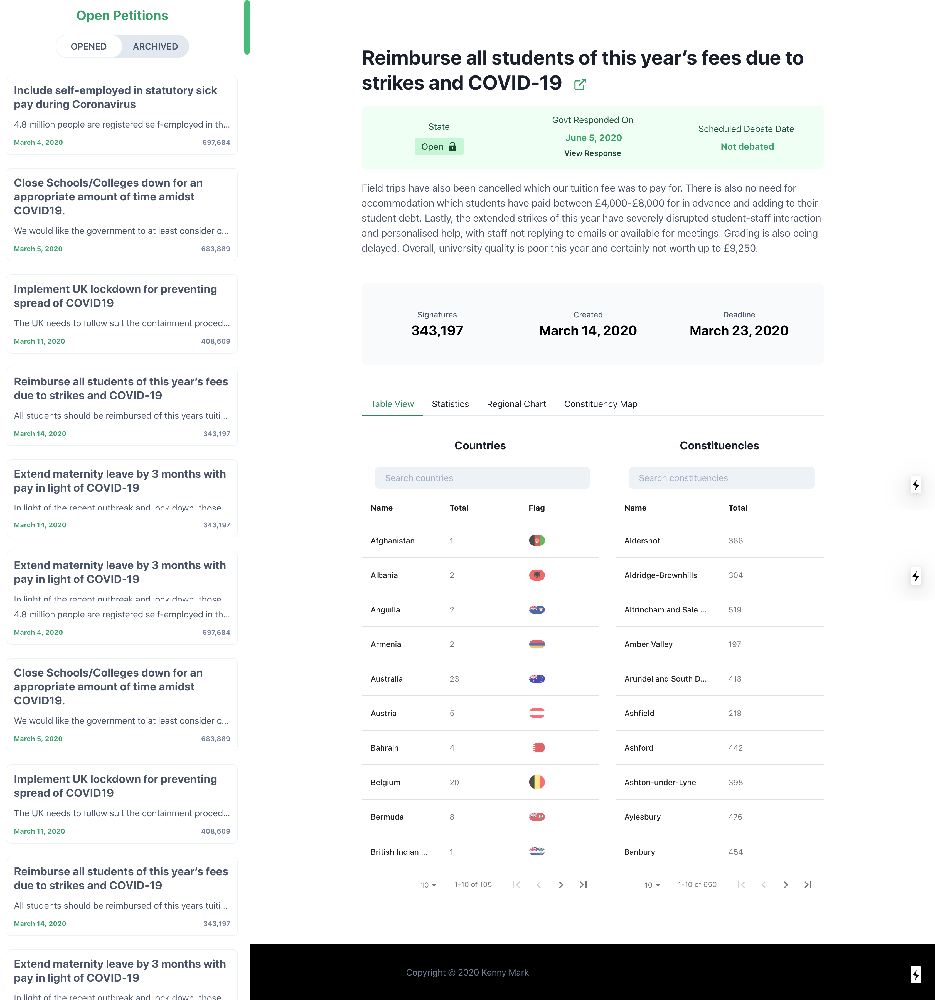
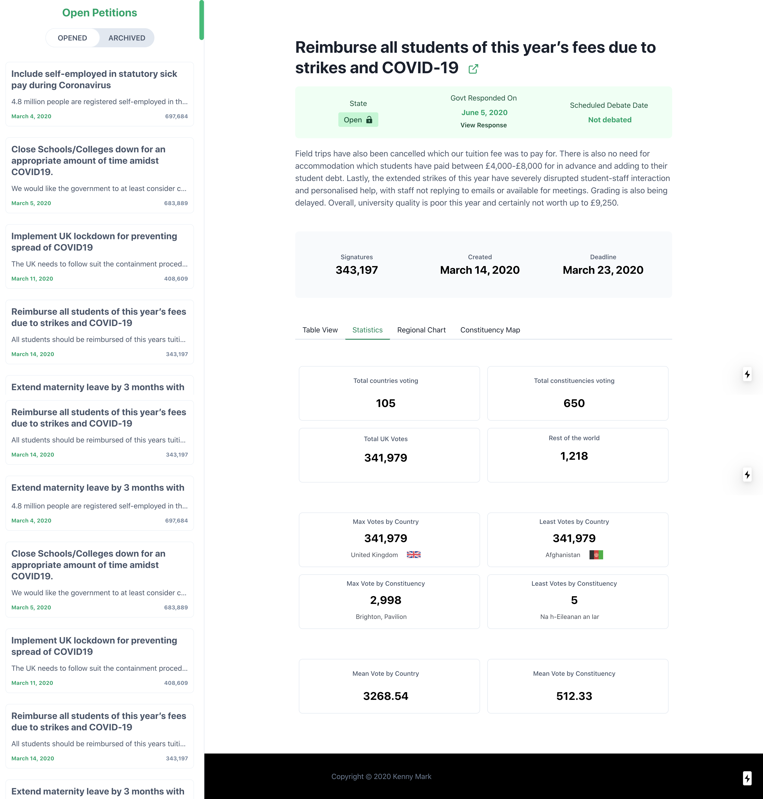
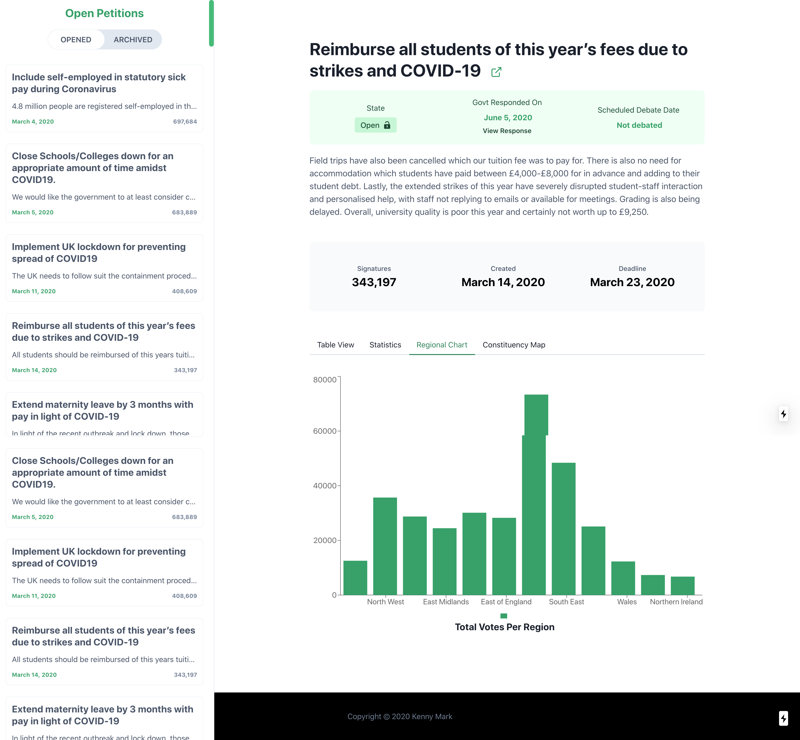

## UK Petitions Dashboards
> An SPA to display to data in a presentable form from the UK parliament petitions

## Description
 
The intended goal of this application is to better present data from petitions of the British parliament. The current [website](https://petition.parliament.uk/petitions?state=open) shows you basic information but does not do a good presenting the extra data. This application shows you a breakdown of such data in a simple digestible form.

## Usage
 
 Clone repo `git clone https://github.com/kennymark/british-petitions-dashboard`

## Screenshots

**Table View**

**Stats View**

**Chart View**

Old Application

## Features 

- Beautiful UI
- Reponsive/Mobile UI
- MapView 
- Built with Nextjs
- Offline support
- Shows statistical support 
- Chart with recharts
- Very fast

## Todo
- Map View
- Pagination
- Load More feature
- Fit data into application